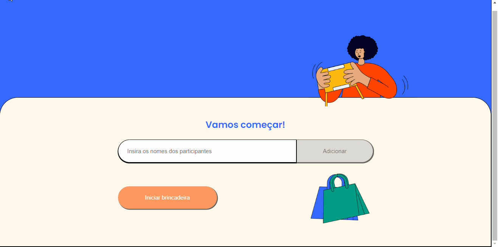
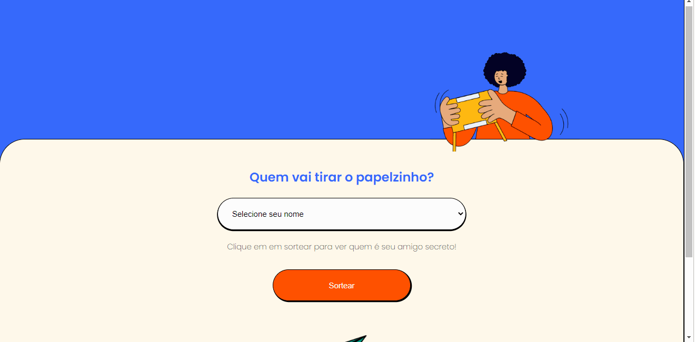

# SORTEADOR DE AMIGO SECRETO

O sorteador de amigo secreto é uma aplicação desenvolvida em React no intuido de que ela 
realize o sorteio de um amigo secreto baseando-se nos nomes que foram adicionados a lista. 

## Tela Inicial

Ao abrir a aplicação o usuário se depara com essa página. Onde ele pode visualizar minha foto e informações sobre mim. Logo abaixo, há
artigos sobre tecnologia, que o usuário pode clicar para visualizar. 

### WEB 

## Tela de Brincadeira Iniciada 

Ao clicar no botão de "iniciar brincadeira", o usuário é encaminhado para essa tela. Onde 
ele pode selecionar o seu nome e clicar em "sortear" para ver a pessoa que ele tirou.

### WEB 

